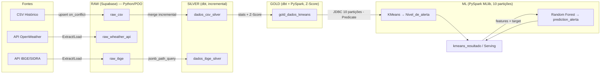
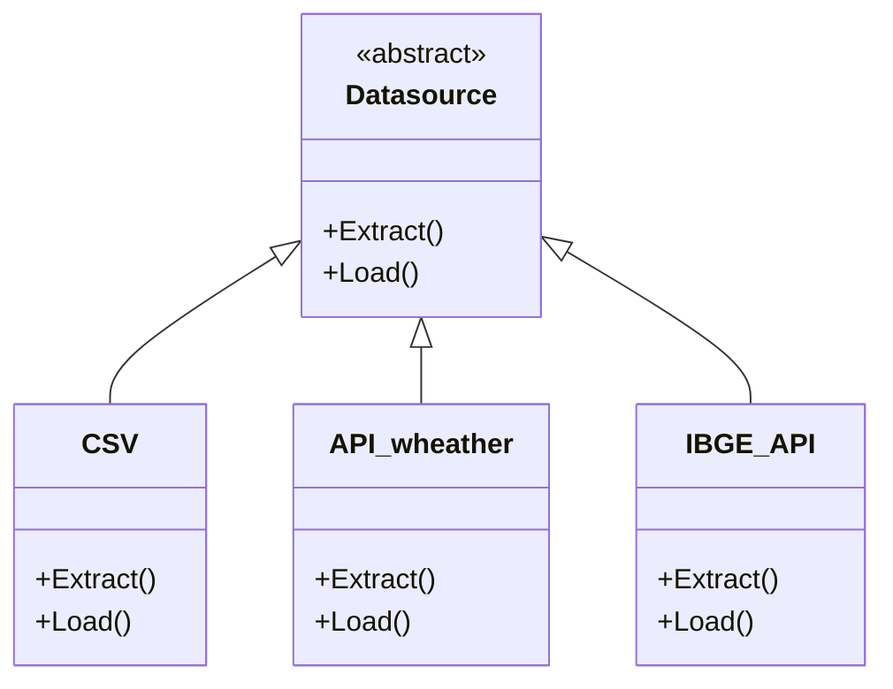
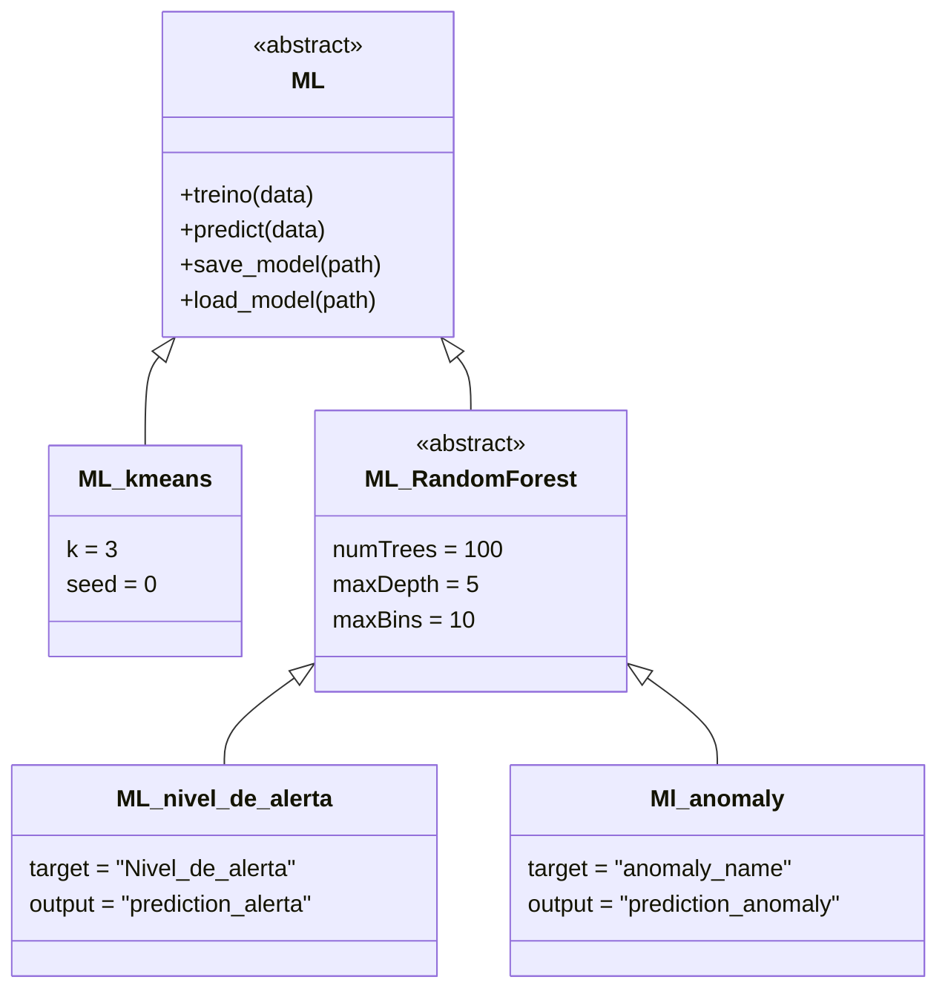
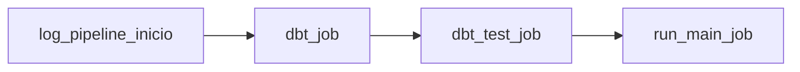

# 🌩️ Climate Anomaly Intelligence Platform

<div align="center">


**Plataforma end-to-end para detecção, classificação e previsão de anomalias climáticas.**
Integra múltiplas fontes de dados (APIs meteorológicas, IBGE, históricos) em uma pipeline de processamento distribuída, gerando predições de anomalias via Machine Learning supervisionado.

[](https://github.com/levi549/meteorologia)
[](https://github.com/levi549/meteorologia/issues)
[](#)

</div>

---

## 📑 Sumário

| | | | |
|---|---|---|---|
| [🏗️ Arquitetura](#️-arquitetura-de-alto-nível) | [🧩 Padrões](#-padrões-arquiteturais) | [🗂️ Camadas](#-detalhamento-por-camada) | [🌬️ Airflow](#-orquestração-apache-airflow) |
| [📁 Estrutura](#-estrutura-de-diretórios) | [🎯 Decisões Técnicas](#-padrões--decisões-técnicas) | [🔄 Fluxo de Dados](#-fluxo-completo-de-dados-fim-a-fim) | [▶️ Como Executar](#️-como-executar) |
| [🐳 Deploy](#-arquitetura-de-deployment--containerização) | [🧱 Stack](#-stack--dependências) | [🛠️ Troubleshooting](#️-troubleshooting) | [📬 Contato](#-contato--suporte) |

---

## 🛠️ Stack Tecnológica

<div align="center">

<table>
<tr>
<td align="center" width="120">
<a href="https://www.python.org/" target="_blank">
<br/>
<b>Python</b><br/>
<sub>3.12+</sub>
</a>
</td>
<td align="center" width="120">
<a href="https://airflow.apache.org/" target="_blank">
<br/>
<b>Airflow</b><br/>
<sub>3.2+</sub>
</a>
</td>
<td align="center" width="120">
<a href="https://spark.apache.org/docs/latest/api/python/" target="_blank">
<br/>
<b>PySpark</b><br/>
<sub>4.1+</sub>
</a>
</td>
<td align="center" width="120">
<a href="https://www.getdbt.com/" target="_blank">
<br/>
<b>dbt</b><br/>
<sub>1.10+</sub>
</a>
</td>
<td align="center" width="120">
<a href="https://supabase.com/" target="_blank">
<br/>
<b>Supabase</b><br/>
<sub>PostgreSQL 15+</sub>
</a>
</td>
<td align="center" width="120">
<a href="https://www.docker.com/" target="_blank">
<br/>
<b>Docker</b><br/>
<sub>Latest</sub>
</a>
</td>
</tr>
</table>

</div>

> 💡 Clique em qualquer ícone acima para acessar a documentação oficial da tecnologia.

---
# 🏗️ Arquitetura do Meteorologia

## Visão Geral

**Meteorologia** é uma plataforma end-to-end de detecção e previsão de anomalias climáticas, construída sobre a **Medallion Architecture** (Raw → Silver → Gold). Dados de clima (OpenWeather), histórico (CSV) e demografia (IBGE) são ingeridos, transformados incrementalmente via dbt, enriquecidos com features estatísticas via PySpark, e usados para treinar modelos de clusterização (KMeans) e classificação (Random Forest) que geram níveis de alerta e classificação de anomalias, tudo orquestrado por Airflow em containers Docker isolados.

---

## 🥉🥈🥇 As 3 Camadas da Medallion Architecture

### Raw Layer

- **Responsabilidade**: ingestão bruta de dados de múltiplas fontes heterogêneas, sem transformação.
- **Localização**: `src/class_file.py`, entry point em `main.py`.
- **Padrões**: Abstract Base Class + Strategy Pattern.
- **Fluxo de dados**: CSV histórico / API OpenWeather / API IBGE-SIDRA → `Extract()` → `Load()` (upsert) → tabelas `raw_csv`, `raw_wheather_api`, `raw_ibge` no Supabase.

```python
class Datasource(ABC):
    @abstractmethod
    def Extract(self): ...
    @abstractmethod
    def Load(self): ...

class CSV(Datasource):
    def Extract(self):
        return pd.read_csv("data/data_Historic.csv")
    def Load(self, df):
        supabase.table("raw_csv").upsert(
            df.to_dict("records"), on_conflict="city_id,dt"
        ).execute()
```

- **Tabelas envolvidas**: `raw_csv`, `raw_wheather_api`, `raw_ibge`.

### Silver Layer

- **Responsabilidade**: limpeza, imputação e engenharia de atributos temporais via SQL declarativo.
- **Localização**: `dbt/raw/dados_csv_silver.sql`, `dbt/raw/dados_ibge_silver.sql`.
- **Padrões**: Incremental Processing (`unique_key='id'`, `incremental_strategy='merge'`).
- **Fluxo de dados**: `raw_csv` → mediana por `city_id` + encoding cíclico + surrogate key → `dados_csv_silver`; `raw_ibge` (JSON) → `jsonb_path_query` + `jsonb_each` → `dados_ibge_silver`.

```sql
-- dados_csv_silver.sql (trecho real)
select
    {{ dbt_utils.generate_surrogate_key(['city_id', 'dt']) }} as id,
    city_name,
    dt,
    sin(extract(month from dt) * 2 * pi() / 12) as mes_sin,
    cos(extract(month from dt) * 2 * pi() / 12) as mes_cos,
    coalesce(temp, temp_mediana) as temp,
    humidity,
    pressure,
    weather_main,
    anomaly_name,
    ingested_at
from raw_csv

where ingested_at > (select max(ingested_at) from {{ this }})

```

- **Tabelas/Modelos**: `dados_csv_silver`, `dados_ibge_silver`.

### Gold Layer

- **Responsabilidade**: padronização estatística (Z-Score) das variáveis para consumo direto por ML.
- **Localização**: `dbt/silver_gold/gold_dados_kmeans.sql`.
- **Padrões**: Incremental merge + tratamento de divisão por zero.
- **Fluxo de dados**: `dados_csv_silver` → stats (média/stddev) por `city_name` → Z-Score → `gold_dados_kmeans`.

```sql
-- gold_dados_kmeans.sql (trecho real)
select
    s.id, s.dt, s.mes_sin, s.mes_cos,
    case when stats.stddev_temp = 0 then 0
         else (s.temp - stats.media_temp) / stats.stddev_temp
    end as temp_padronizado,
    case when stats.stddev_humidity = 0 then 0
         else (s.humidity - stats.media_humidity) / stats.stddev_humidity
    end as humidity_padronizado,
    case when stats.stddev_pressure = 0 then 0
         else (s.pressure - stats.media_pressure) / stats.stddev_pressure
    end as pressure_padronizada,
    s.anomaly_name, s.ingested_at
from dados_csv_silver s
left join stats_por_cidade stats on s.city_name = stats.city_name
```

- **Tabelas/Modelos**: `gold_dados_kmeans`.

### ML Layer

- **Responsabilidade**: treino e inferência de modelos de clusterização e classificação sobre features padronizadas.
- **Localização**: `src/ML.py`, `pyspark_jobs/jobs/*.py`.
- **Padrões**: Hierarquia ABC + Distributed Partitioning (via `Predicate`).
- **Fluxo de dados**: `gold_dados_kmeans` (JDBC, 10 partições) → VectorAssembler → KMeans → `kmeans_resultado` → VectorAssembler (com `Nivel_de_alerta`) → Random Forest → `/modelos/`.

```python
class ML(ABC):
    @abstractmethod
    def treino(self, data): ...
    @abstractmethod
    def predict(self, data): ...
    @abstractmethod
    def save_model(self, path): ...
    @abstractmethod
    def load_model(self, path): ...

class ML_kmeans(ML):
    def treino(self, data):
        self.model = KMeans(k=3, seed=0,
                             featureCol="features",
                             predictionCol="prediction").fit(data)
```

- **Tabelas/Modelos**: `kmeans_resultado`, `log_job`, artefatos em `/modelos/`.

---

## 🧩 Padrões Arquiteturais

| Padrão | O Quê | Onde | Por Quê |
|---|---|---|---|
| **Medallion Architecture** | Separação Raw → Silver → Gold | Supabase (schemas) + dbt | Isola responsabilidades, permite reprocessamento e auditoria por camada |
| **Abstract Base Classes (Strategy)** | `Datasource(ABC)` e `ML(ABC)` com implementações intercambiáveis | `src/class_file.py`, `src/ML.py` | Nova fonte de dados ou modelo = nova classe, sem alterar código existente |
| **Incremental Processing (dbt)** | `unique_key` + `incremental_strategy='merge'` | `dbt/raw/*.sql`, `dbt/silver_gold/*.sql` | Evita reprocessar histórico inteiro a cada run, reduz custo e tempo |
| **Distributed Partitioning** | Classe `Predicate` gera 10 WHERE clauses | `src/predicate.py` | Paraleliza leitura JDBC em 10 conexões simultâneas no Spark |
| **Context Manager Logging** | `log_job()` com try/yield/except/finally | `src/logs.py` | Garante status RUNNING/SUCCESS/FAILED consistente mesmo em falhas |
| **Feature Engineering Distribuído** | VectorAssembler + Z-Score em PySpark | `pyspark_jobs/jobs/*.py` | Processa volumes grandes de forma distribuída antes do treino |
| **Encoding Cíclico Temporal** | `sin`/`cos` do mês | `dados_csv_silver.sql` | Representa continuidade sazonal (dezembro e janeiro ficam próximos) |

---

## 🔄 Fluxo Completo de Dados



**Anotações**:
- **Python (POO)** processa a camada Raw; **dbt (SQL)** processa Silver e parte do Gold; **PySpark** processa Gold→ML e toda a camada ML.
- **Paralelização**: a classe `Predicate` divide o range de `ingested_at`/`dt` em 10 predicados WHERE, lidos simultaneamente via JDBC.
- **Incrementalidade**: dbt usa `unique_key` e filtro por `ingested_at`; jobs PySpark consultam `log_job` para saber o último timestamp processado (fallback `1970-01-01` na primeira execução).

---

## 🔧 Componentes Principais

### 1. Ingestão (Datasource Pattern)



`CSV` lê `data/data_Historic.csv` e escreve em `raw_csv` com upsert `on_conflict="city_id,dt"`. `API_wheather` busca dados por cidade na OpenWeather API e grava JSON em `raw_wheather_api`. `IBGE_API` busca IDs de municípios e dados populacionais via SIDRA, gravando em `raw_ibge`. Todas usam `Supabase.create_client()` com credenciais via `.env`.

### 2. Transformação (dbt)

dbt foi escolhido sobre Python puro por oferecer **SQL declarativo, versionamento de modelos e testes nativos** (`dbt test`), reduzindo a superfície de bugs em transformações repetitivas. O pipeline segue `dbt/raw/` → `dbt/silver_gold/`.

`dados_csv_silver.sql` calcula medianas por `city_id` para imputação robusta a outliers, aplica encoding cíclico (`mes_sin`, `mes_cos`) e usa `COALESCE(temp, temp_mediana)`. A incrementalidade é garantida por `unique_key='id'` combinado com `incremental_strategy='merge'`, processando apenas registros novos.

### 3. Feature Engineering (PySpark)

A classe `Predicate(Vmin, Vmax, Vmin2, Vmax2, num_partitions=10)` gera 10 cláusulas WHERE dividindo o intervalo de `ingested_at` (ou `dt`, se o primeiro não tiver range válido) em faixas iguais:

```python
predicates = [
    "ingested_at >= '2026-01-01' and ingested_at <= '2026-01-04'",
    "ingested_at >= '2026-01-04' and ingested_at <= '2026-01-08'",
    # ... até 10 predicados
]
df = spark.read.jdbc(url=jdbc_url, table="gold_dados_kmeans",
                      predicates=predicates, properties=props)
```

O Z-Score é normalizado com tratamento explícito de `stddev=0 → 0`, evitando divisão por zero em cidades com variância nula. O `VectorAssembler` monta o vetor de 5 features para o KMeans: `mes_sin, mes_cos, temp_padronizado, humidity_padronizado, pressure_padronizada`.

### 4. Machine Learning (Hierarquia de Modelos)



KMeans roda com `k=3` (mapeando os 3 níveis de negócio: Baixo/Moderado/Severo) e `seed=0` para reprodutibilidade. Random Forest usa `numTrees=100`, `maxDepth=5`, `maxBins=10`, escolhido por robustez a outliers e capacidade de capturar interações não lineares. Persistência via `.write().overwrite().save(path)` em `/modelos/`.

### 5. Logging Transacional

```python
@contextmanager
def log_job(self, nome_job, pipeline_id):
    # INSERT com status="RUNNING"
    try:
        yield
    except Exception as e:
        # UPDATE status="FAILED" + error
        raise
    else:
        # UPDATE status="SUCCESS" + ultima_dt_processada
```

Duas classes cobrem granularidades diferentes: `log` rastreia jobs individuais (com `ultima_dt_processada` alimentando a incrementalidade dos jobs PySpark); `log_pipeline` rastreia a execução completa via callbacks do Airflow (`log_sucesso`/`log_erro`).

### 6. Orquestração (Airflow)



A DAG `pipeline_meteorologia_main` roda com `schedule_interval='@once'` (trigger manual) e `catchup=False`. Cada task de transformação/ML usa `DockerOperator` com imagem própria (`meteorologia-dbt:latest`, `meteorologia-pyspark:latest`), rodando na network customizada `minha-rede`, com variáveis injetadas do `.env` e bind mounts para `/app/parquet` e `/app/modelos`. Callbacks `on_failure_callback`/`on_success_callback` acionam `log_pipeline`.

---

## 🎯 Decisões Técnicas Justificadas

| Decisão | Justificativa |
|---|---|
| **Supabase** vs BigQuery/Snowflake | PostgreSQL real com dbt-postgres nativo e API REST simples para ingestão, sem overhead de infraestrutura analítica dedicada |
| **dbt** vs Python para Silver | SQL declarativo, versionamento de modelos e testes (`dbt test`) nativos reduzem bugs em transformações repetitivas |
| **Encoding cíclico** (sin/cos) vs one-hot | Captura a continuidade sazonal corretamente — dezembro e janeiro ficam matematicamente próximos, o que one-hot não representa |
| **KMeans com k=3** | Necessidade de negócio de exatamente 3 níveis de alerta: Baixo, Moderado, Severo |
| **Random Forest** vs Logistic Regression | Robusto a outliers e capaz de capturar interações não lineares entre variáveis climáticas |
| **ABC para ingestão** | Extensibilidade: adicionar uma nova fonte de dados é implementar uma classe, sem tocar no código existente |
| **Classe `Predicate`** | Paraleliza leitura JDBC dividindo o range temporal em 10 predicados, evitando full-scan single-thread |

---

## 📈 Escalabilidade & Extensibilidade

- **Escalabilidade horizontal**: Spark distribui o processamento em 10 partições JDBC; Airflow permite adicionar workers para paralelizar DAGs.
- **Escalabilidade de fontes**: nova fonte de dados = nova subclasse de `Datasource(ABC)`, plugável sem alterar `main.py`.
- **Escalabilidade de modelos**: novo classificador = nova subclasse de `ML_RandomForest` (ou de `ML` diretamente), reaproveitando o contrato `treino/predict/save_model/load_model`.
- **Cache**: resultados intermediários podem ser persistidos em Parquet local, acelerando re-treinos sem nova leitura JDBC completa.

---

## 🐳 Deployment & Containerização

- **4 Dockerfiles separados**: Airflow, dbt, ingestão (Python/POO) e PySpark — cada serviço isolado com suas próprias dependências.
- **Docker Compose** orquestra a subida conjunta de todos os containers.
- **Network customizada** `minha-rede` (bridge) conecta os serviços entre si.
- **Volumes**: bind mounts para `/app/parquet` (cache) e `/app/modelos` (artefatos de ML), garantindo persistência entre execuções da DAG.

---

## 📬 Contato & Suporte

<div align="center">

[](https://github.com/levi549)
[](https://github.com/levi549/meteorologia)
[](https://github.com/levi549/meteorologia/issues)

</div>

---

<div align="center">
<sub>Construído com 🌩️ por <a href="https://github.com/levi549">@levi549</a></sub>
</div>