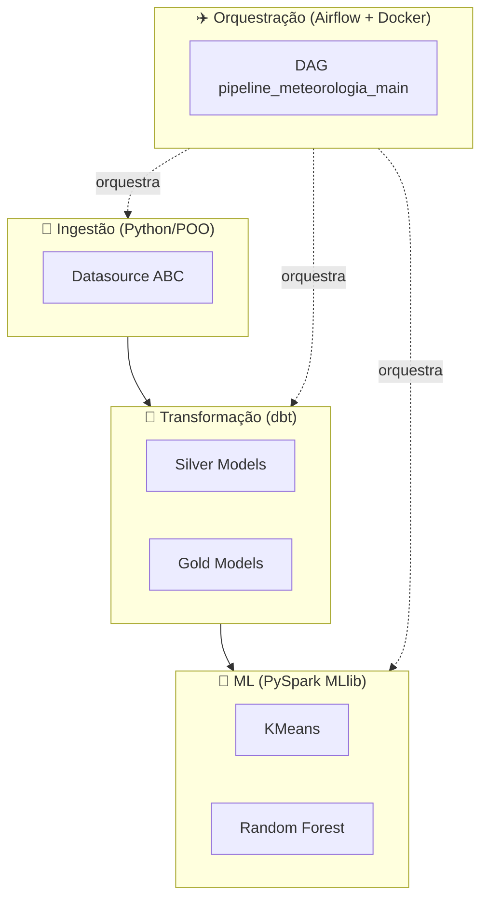
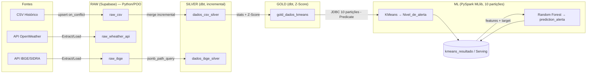
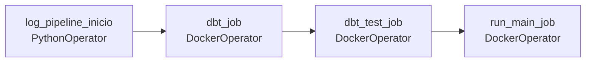
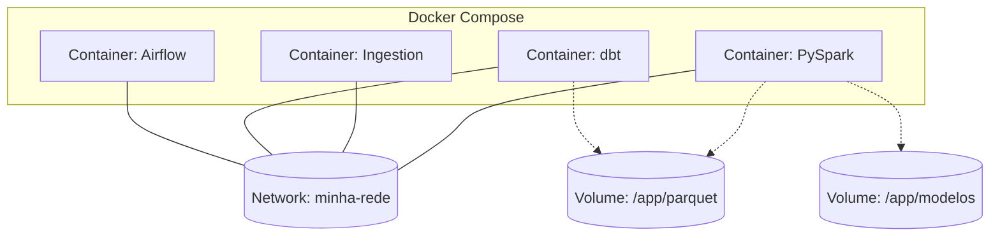

# 🌩️ Climate Anomaly Intelligence Platform

<div align="center">


**Plataforma end-to-end para detecção, classificação e previsão de anomalias climáticas.**
Integra múltiplas fontes de dados (APIs meteorológicas, IBGE, históricos) em uma pipeline de processamento distribuída, gerando predições de anomalias via Machine Learning supervisionado.(OBS:Em fase final de desenvolvimento)

[](https://github.com/levi549/meteorologia)
[](https://github.com/levi549/meteorologia/issues)
[](#)

</div>

---
 
## 📑 Sumário
 
| | | |
|---|---|---|
| [📐 Arquitetura](#-arquitetura-1) | [🧩 Padrões](#-padrões-arquiteturais) | [🥉 Camadas](#-as-camadas-da-medallion-architecture) |
| [✈️ Airflow](#-orquestração-airflow) | [📂 Estrutura](#-estrutura-de-diretórios) | [🎯 Decisões Técnicas](#-decisões-técnicas-justificadas) |
| [🔄 Fluxo de Dados](#-fluxo-completo-de-dados) | [🐳 Deploy](#-deployment--containerização) | [📚 Stack](#-stack-tecnológico) |
 
---
 

## 🛠️ Stack Tecnológica

<div align="center">

<table>
<tr>
<td align="center" width="120">
<a href="https://www.python.org/" target="_blank">
<br/>
<b>Python</b><br/>
<sub>3.12+</sub>
</a>
</td>
<td align="center" width="120">
<a href="https://airflow.apache.org/" target="_blank">
<br/>
<b>Airflow</b><br/>
<sub>3.2+</sub>
</a>
</td>
<td align="center" width="120">
<a href="https://spark.apache.org/docs/latest/api/python/" target="_blank">
<br/>
<b>PySpark</b><br/>
<sub>4.1+</sub>
</a>
</td>
<td align="center" width="120">
<a href="https://www.getdbt.com/" target="_blank">
<br/>
<b>dbt</b><br/>
<sub>1.10+</sub>
</a>
</td>
<td align="center" width="120">
<a href="https://supabase.com/" target="_blank">
<br/>
<b>Supabase</b><br/>
<sub>PostgreSQL 15+</sub>
</a>
</td>
<td align="center" width="120">
<a href="https://www.docker.com/" target="_blank">
<br/>
<b>Docker</b><br/>
<sub>Latest</sub>
</a>
</td>
</tr>
</table>

</div>

> 💡 Clique em qualquer ícone acima para acessar a documentação oficial da tecnologia.

---
# 🏗️ Arquitetura do Meteorologia

<h2 id="-visão-geral">🔎 Visão Geral</h2>
 
O **Meteorologia** é uma plataforma que ingere dados climáticos (histórico em CSV, API OpenWeather) e demográficos (API IBGE/SIDRA), processa-os através de camadas incrementais em SQL (dbt) e Spark (PySpark), e treina modelos de Machine Learning — KMeans para clusterização de níveis de alerta e Random Forest para classificação de anomalias. Todo o pipeline é orquestrado por Airflow e executado em containers Docker isolados, seguindo o padrão **Medallion Architecture** (Raw → Silver → Gold) como espinha dorsal do fluxo de dados.
 
---
 
<h2 id="-arquitetura-1">📐 Arquitetura</h2>
 
A arquitetura é dividida em 4 grandes blocos, cada um com responsabilidade única e desacoplada dos demais:
 

 
**Princípios de design**:
- **Desacoplamento por camada**: cada camada (Raw/Silver/Gold/ML) só conhece a interface da camada anterior, nunca sua implementação interna.
- **Extensibilidade via ABC**: novas fontes de dados ou modelos são adicionados como novas classes, sem alterar código existente (Open/Closed Principle).
- **Idempotência e incrementalidade**: toda escrita usa upsert ou merge, permitindo re-execução segura da pipeline.
- **Observabilidade**: toda execução (job e pipeline) é registrada transacionalmente via context managers em `src/logs.py`.
---
 
<h2 id="-as-camadas-da-medallion-architecture">🥉🥈🥇 As Camadas da Medallion Architecture</h2>
 
### Raw Layer
 
- **Responsabilidade**: ingestão bruta de dados de múltiplas fontes heterogêneas, sem transformação.
- **Localização**: `src/class_file.py`, entry point em `main.py`.
- **Padrões**: Abstract Base Class + Strategy Pattern.
- **Fluxo de dados**: CSV histórico / API OpenWeather / API IBGE-SIDRA → `Extract()` → `Load()` (upsert) → tabelas `raw_csv`, `raw_wheather_api`, `raw_ibge` no Supabase.
```python
class Datasource(ABC):
    @abstractmethod
    def Extract(self): ...
    @abstractmethod
    def Load(self): ...
 
class CSV(Datasource):
    def Extract(self):
        return pd.read_csv("data/data_Historic.csv")
 
    def Load(self, df):
        supabase.table("raw_csv").upsert(
            df.to_dict("records"), on_conflict="city_id,dt"
        ).execute()
```
 
- **`API_wheather`**: faz fetch na OpenWeather API por cidade e grava JSON bruto em `raw_wheather_api`.
- **`IBGE_API`**: busca IDs de municípios e dados populacionais (SIDRA) e grava JSON em `raw_ibge`.
- **Conexão**: `Supabase.create_client()` com credenciais lidas via `.env`.
- **Tabelas envolvidas**: `raw_csv`, `raw_wheather_api`, `raw_ibge`.
### Silver Layer
 
- **Responsabilidade**: limpeza, imputação de nulos e engenharia de atributos temporais via SQL declarativo.
- **Localização**: `dbt/raw/dados_csv_silver.sql`, `dbt/raw/dados_ibge_silver.sql`.
- **Padrões**: Incremental Processing (`unique_key='id'`, `incremental_strategy='merge'`).
- **Fluxo de dados**: `raw_csv` → mediana por `city_id` + encoding cíclico + surrogate key → `dados_csv_silver`; `raw_ibge` (JSON) → `jsonb_path_query` + `jsonb_each` → `dados_ibge_silver`.
```sql
-- dados_csv_silver.sql (trecho real)
{{ config(materialized='incremental', unique_key='id', incremental_strategy='merge') }}
 
select
    {{ dbt_utils.generate_surrogate_key(['city_id', 'dt']) }} as id,
    city_name,
    dt,
    sin(extract(month from dt) * 2 * pi() / 12) as mes_sin,
    cos(extract(month from dt) * 2 * pi() / 12) as mes_cos,
    coalesce(temp, temp_mediana) as temp,
    humidity,
    pressure,
    weather_main,
    anomaly_name,
    ingested_at
from raw_csv
left join medianas_por_cidade using (city_id)

where ingested_at > (select max(ingested_at) from {{ this }})

```
 
```sql
-- dados_ibge_silver.sql (trecho real)
select
    jsonb_path_query(payload, '$[*].resultados[*].series[*]') as serie,
    ingested_at
from raw_ibge,
lateral jsonb_each(serie -> 'serie') as valores
```
 
- **Tabelas/Modelos**: `dados_csv_silver` (`id, city_name, dt, mes_sin, mes_cos, temp, humidity, pressure, weather_main, anomaly_name, ingested_at`), `dados_ibge_silver` (`nome, populacao, ingested_at`).
### Gold Layer
 
- **Responsabilidade**: padronização estatística (Z-Score) das variáveis para consumo direto por ML.
- **Localização**: `dbt/silver_gold/gold_dados_kmeans.sql`.
- **Padrões**: Incremental merge automático + tratamento de divisão por zero.
- **Fluxo de dados**: `dados_csv_silver` → estatísticas (média/stddev por `city_name`) → Z-Score → `gold_dados_kmeans`.
```sql
-- gold_dados_kmeans.sql (trecho real)
with stats as (
    select city_name,
           avg(temp) as media_temp, stddev(temp) as stddev_temp,
           avg(humidity) as media_humidity, stddev(humidity) as stddev_humidity,
           avg(pressure) as media_pressure, stddev(pressure) as stddev_pressure
    from dados_csv_silver
    group by city_name
)
select
    s.id, s.dt, s.mes_sin, s.mes_cos,
    case when stats.stddev_temp = 0 then 0
         else (s.temp - stats.media_temp) / stats.stddev_temp end as temp_padronizado,
    case when stats.stddev_humidity = 0 then 0
         else (s.humidity - stats.media_humidity) / stats.stddev_humidity end as humidity_padronizado,
    case when stats.stddev_pressure = 0 then 0
         else (s.pressure - stats.media_pressure) / stats.stddev_pressure end as pressure_padronizada,
    s.anomaly_name, s.ingested_at
from dados_csv_silver s
left join stats on s.city_name = stats.city_name
```
 
- **Tabelas/Modelos**: `gold_dados_kmeans` (`id, dt, mes_sin, mes_cos, temp_padronizado, humidity_padronizado, pressure_padronizada, anomaly_name, ingested_at`).
### ML Layer
 
- **Responsabilidade**: treino e inferência de modelos de clusterização e classificação sobre features padronizadas.
- **Localização**: `src/ML.py`, `pyspark_jobs/jobs/*.py`.
- **Padrões**: Hierarquia ABC + Distributed Partitioning (via `Predicate`).
- **Fluxo de dados**: `gold_dados_kmeans` (JDBC, 10 partições) → VectorAssembler → KMeans → `kmeans_resultado` → VectorAssembler (com `Nivel_de_alerta`) → Random Forest → `/modelos/`.
```python
class ML(ABC):
    @abstractmethod
    def treino(self, data): ...
    @abstractmethod
    def predict(self, data): ...
    @abstractmethod
    def save_model(self, path): ...
    @abstractmethod
    def load_model(self, path): ...
 
class ML_kmeans(ML):
    def treino(self, data):
        self.model = KMeans(k=3, seed=0,
                             featureCol="features",
                             predictionCol="prediction").fit(data)
 
    def predict(self, data):
        return self.model.transform(data)
 
    def save_model(self, path):
        self.model.write().overwrite().save(path)
 
    def load_model(self, path):
        self.model = KMeansModel.load(path)
```
 
- **Tabelas/Modelos**: `kmeans_resultado`, `log_job`, artefatos persistidos em `/modelos/`.
---
 
<h2 id="-padrões-arquiteturais">🧩 Padrões Arquiteturais</h2>
 
| Padrão | O Quê | Onde | Por Quê |
|---|---|---|---|
| **Medallion Architecture** | Separação Raw → Silver → Gold | Supabase (schemas) + dbt | Isola responsabilidades, permite reprocessamento e auditoria por camada |
| **Abstract Base Classes (Strategy)** | `Datasource(ABC)` e `ML(ABC)` com implementações intercambiáveis | `src/class_file.py`, `src/ML.py` | Nova fonte de dados ou modelo = nova classe, sem alterar código existente |
| **Incremental Processing (dbt)** | `unique_key` + `incremental_strategy='merge'` | `dbt/raw/*.sql`, `dbt/silver_gold/*.sql` | Evita reprocessar histórico inteiro a cada run, reduz custo e tempo |
| **Distributed Partitioning** | Classe `Predicate` gera 10 WHERE clauses | `src/predicate.py` | Paraleliza leitura JDBC em 10 conexões simultâneas no Spark |
| **Context Manager Logging e MLflow** | `log_job()` com try/yield/except/finally | `src/logs.py` | Garante status RUNNING/SUCCESS/FAILED consistente mesmo em falhas |
| **Feature Engineering Distribuído** | VectorAssembler + Z-Score em PySpark | `pyspark_jobs/jobs/*.py` | Processa volumes grandes de forma distribuída antes do treino |
| **Encoding Cíclico Temporal** | `sin`/`cos` do mês | `dados_csv_silver.sql` | Representa continuidade sazonal (dez→jan são adjacentes) |
| **DockerOperator por Task** | Cada task Airflow roda em container isolado | `dags/pipeline_main.py` | Isola dependências de cada etapa (dbt, PySpark) sem conflito de ambiente |
 
---
 
<h2 id="-fluxo-completo-de-dados">🔄 Fluxo Completo de Dados</h2>
 

 
**Anotações**:
- **Python (POO)** processa a camada Raw; **dbt (SQL)** processa Silver e parte do Gold; **PySpark** processa Gold→ML e toda a camada ML.
- **Paralelização**: a classe `Predicate` divide o range de `ingested_at`/`dt` em 10 predicados WHERE, lidos simultaneamente via JDBC.
- **Incrementalidade**: dbt usa `unique_key` e filtro por `ingested_at`; jobs PySpark consultam `log_job` para saber o último timestamp processado (fallback `1970-01-01` na primeira execução).
### Detalhamento dos Jobs PySpark
 
**`job_kmeans_train()`**
1. Fetch limites (min/max de `ingested_at` e `dt`) da tabela `gold_dados_kmeans`.
2. Gera 10 predicates via `Predicate`.
3. Lê JDBC com predicates (10 partições paralelas).
4. `VectorAssembler` com colunas: `mes_sin, mes_cos, temp_padronizado, humidity_padronizado, pressure_padronizada`.
5. Instancia `ML_kmeans()` e chama `.treino(df_features)`.
6. Salva modelo em `/modelos/`.
**`job_kmeans()`**
1. Fetch limites a partir de `log_job` (fallback `1970-01-01` se primeira execução).
2. Lê com predicates.
3. Assembler dos mesmos features.
4. Carrega modelo pré-treinado.
5. `.predict()` → renomeia `"prediction"` para `"Nivel_de_alerta"`.
6. Write JDBC em modo `append` para `kmeans_resultado`.
7. Opcional: salva parquet em cache local para leitura rápida.
**`job_ml_nivel_de_alerta_train()`**
1. Lê de `kmeans_resultado` (via predicates ou parquet cache).
2. `.dropna()` para limpeza.
3. `VectorAssembler` com: `mes_sin, mes_cos, temp, humidity, pressure, Nivel_de_alerta` (target incluído).
4. Instancia `ML_nivel_de_alerta()` (Random Forest).
5. `.treino(df_features)`.
6. Salva modelo em `/modelos/ml_nivel_de_alerta_model`.
```python
# src/predicate.py
class Predicate:
    def __init__(self, Vmin, Vmax, Vmin2, Vmax2, num_partitions=10):
        self.Vmin, self.Vmax = Vmin, Vmax
        self.Vmin2, self.Vmax2 = Vmin2, Vmax2
        self.num_partitions = num_partitions
 
    def gerar_predicate(self):
        if self.Vmin and self.Vmax:
            return self._particionar("ingested_at", self.Vmin, self.Vmax)
        return self._particionar("dt", self.Vmin2, self.Vmax2)
```
 
---
 
<h2 id="-orquestração-airflow">✈️ Orquestração (Airflow)</h2>
 
- **Localização**: `dags/pipeline_main.py`.
- **DAG**: `pipeline_meteorologia_main`.
**Configuração**:
- `schedule_interval='@once'` (trigger manual)
- `start_date=datetime(2026, 7, 10)`
- `catchup=False`
- `on_failure_callback=log.log_erro`
- `on_success_callback=log.log_sucesso`

 
**Detalhes do `DockerOperator`**:
- Cada task usa imagem Docker específica (`meteorologia-dbt:latest`, `meteorologia-pyspark:latest`).
- Network mode: `minha-rede` (bridge customizada).
- Variáveis de ambiente injetadas do `.env`.
- Mounts (bind mounts locais) para `/app/parquet` e `/app/modelos`.
O logging transacional acompanha cada etapa: `log_pipeline_inicio` registra o início do pipeline (`status="RUNNING"`), e os callbacks Airflow atualizam o status final (`SUCCESS`/`FAILED`) com a exceção capturada, se houver.
 
```python
# src/logs.py
class log:
    @contextmanager
    def log_job(self, nome_job, pipeline_id):
        # INSERT com status="RUNNING"
        try:
            yield
        except Exception as e:
            # UPDATE status="FAILED" + error
            raise
        else:
            # UPDATE status="SUCCESS" + ultima_dt_processada
            pass
 
class log_pipeline:
    def log_inicio(self):
        ...  # INSERT status="RUNNING"
    def log_sucesso(self, context):
        ...  # UPDATE status="SUCCESS" (callback Airflow)
    def log_erro(self, context):
        ...  # UPDATE status="FAILED" + exception
```
 
---
 
<h2 id="-estrutura-de-diretórios">📂 Estrutura de Diretórios</h2>
 
```
meteorologia/
├── src/
│   ├── class_file.py          # Datasource(ABC) + CSV + API_wheather + IBGE_API
│   ├── ML.py                  # ML(ABC) + ML_kmeans + ML_RandomForest + subclasses
│   ├── logs.py                # log + log_pipeline (context managers)
│   └── predicate.py           # Classe Predicate para gerar WHERE clauses
├── dbt/
│   ├── raw/
│   │   ├── dados_csv_silver.sql    # Imputação + encoding cíclico
│   │   ├── dados_ibge_silver.sql   # JSON unpacking
│   │   └── sources.yml
│   ├── silver_gold/
│   │   ├── gold_dados_kmeans.sql   # Z-Score + incremental merge
│   │   └── models.yml
│   ├── dbt_project.yml
│   └── profiles.yml
├── pyspark_jobs/
│   ├── main_job.py            # Inicializa Spark + orquestra 3 jobs
│   └── jobs/
│       ├── kmeans_job.py                     # Treino KMeans
│       ├── job_kmeans_train.py               # Alternativo de treino
│       ├── job_ml_nivel_de_alerta_train.py   # Treino RF
│       └── job_ml_nivel_de_alerta.py         # Inferência RF
├── dags/
│   └── pipeline_main.py       # DAG Airflow com 4 tasks principais
├── data/
│   └── data_Historic.csv      # Dados históricos (ingestão)
├── Docker*.yml                # 4 Dockerfiles (airflow, dbt, ingestion, pyspark)
├── Docker-compose.yml         # Orquestração de containers
├── main.py                    # Entry point ingestão
├── pyproject.toml             # Dependências
├── profiles.yml               # Config dbt
└── README.md
```
 
**Convenções de organização**:
- Código Python de domínio (`src/`) é desacoplado de jobs de execução (`pyspark_jobs/`).
- Modelos dbt são separados por camada em subpastas (`raw/`, `silver_gold/`), refletindo a Medallion Architecture no próprio filesystem.
- Cada serviço (Airflow, dbt, ingestão, PySpark) possui seu próprio Dockerfile, evitando conflito de dependências entre ambientes.
---
 
<h2 id="-decisões-técnicas-justificadas">🎯 Decisões Técnicas Justificadas</h2>
 
| Decisão | Justificativa |
|---|---|
| **Supabase** vs BigQuery/Snowflake | PostgreSQL real com dbt-postgres nativo e API REST simples para ingestão, sem overhead de infraestrutura analítica dedicada |
| **dbt** vs Python para Silver | SQL declarativo, versionamento de modelos e testes (`dbt test`) nativos reduzem bugs em transformações repetitivas |
| **Encoding cíclico** (sin/cos) vs one-hot | Captura a continuidade sazonal corretamente — dezembro e janeiro ficam matematicamente próximos, o que one-hot não representa |
| **KMeans com k=3** | Necessidade de negócio de exatamente 3 níveis de alerta: Baixo, Moderado, Severo |
| **Random Forest** vs Logistic Regression | Robusto a outliers e capaz de capturar interações não lineares entre variáveis climáticas |
| **ABC para ingestão** | Extensibilidade: adicionar uma nova fonte de dados é implementar uma classe, sem tocar no código existente |
| **Classe `Predicate`** | Paraleliza leitura JDBC dividindo o range temporal em 10 predicados, evitando full-scan single-thread |
| **DockerOperator por task** | Isola dependências de cada etapa (dbt vs PySpark têm stacks conflitantes) sem exigir imagem única monolítica |
 
---
 
<h2 id="-deployment--containerização">🐳 Deployment & Containerização</h2>
 

 
- **4 Dockerfiles separados**: Airflow, dbt, ingestão (Python/POO) e PySpark — cada serviço isolado com suas próprias dependências.
- **Docker Compose** orquestra a subida conjunta de todos os containers.
- **Network customizada** `minha-rede` (bridge) conecta os serviços entre si.
- **Volumes**: bind mounts para `/app/parquet` (cache) e `/app/modelos` (artefatos de ML), garantindo persistência entre execuções da DAG.
---
 
<h2 id="-stack-tecnológico">📚 Stack Tecnológico</h2>
 
| Componente | Tecnologia | Versão |
|---|---|---|
| Linguagem | Python | 3.12+ |
| Orquestração | Apache Airflow (DAG-based) | 3.2+ |
| Processamento Distribuído | PySpark (MLlib) | 4.1+ |
| Transformação | dbt (dbt-postgres) | 1.10+ |
| Data Warehouse | Supabase (PostgreSQL) | 15+ |
| Containerização | Docker | 4 Dockerfiles separados |
| Gerenciamento de Dependências | uv / pip | — |
| Driver JDBC | PostgreSQL Driver | 42.7.2 |
 
---
 
## 📈 Escalabilidade & Extensibilidade
 
- **Escalabilidade horizontal**: Spark distribui o processamento em 10 partições JDBC; Airflow permite adicionar workers para paralelizar DAGs.
- **Escalabilidade de fontes**: nova fonte de dados = nova subclasse de `Datasource(ABC)`, plugável sem alterar `main.py`.
- **Escalabilidade de modelos**: novo classificador = nova subclasse de `ML_RandomForest` (ou de `ML` diretamente), reaproveitando o contrato `treino/predict/save_model/load_model`.
- **Cache**: resultados intermediários podem ser persistidos em Parquet local, acelerando re-treinos sem nova leitura JDBC completa.

## 📬 Contato & Suporte

<div align="center">

[](https://github.com/levi549)
[](https://github.com/levi549/meteorologia)
[](https://github.com/levi549/meteorologia/issues)

</div>

---

<div align="center">
<sub>Construído  por <a href="https://github.com/levi549">@levi549</a></sub>
</div>