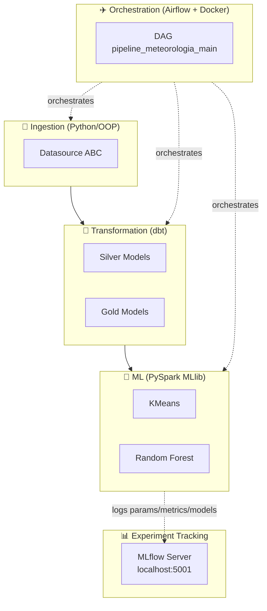
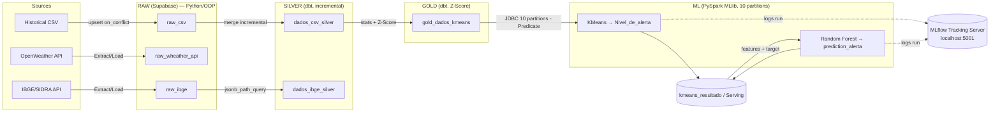
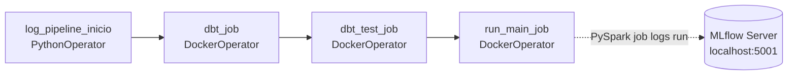
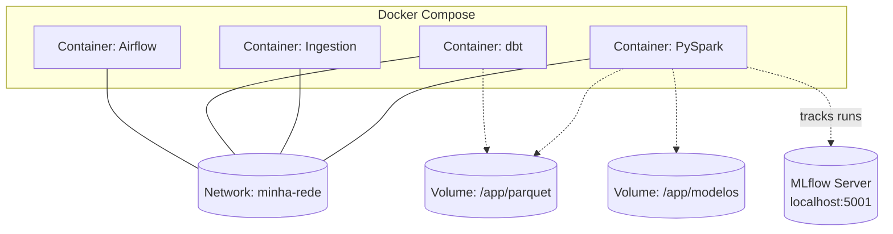

# 🌩️ Climate Anomaly Intelligence Platform

<div align="center">


**End-to-end platform for detection, classification, and forecasting of climate anomalies.**
Integrates multiple data sources (weather APIs, IBGE, historical records) into a distributed processing pipeline, generating anomaly predictions via supervised Machine Learning.

[](https://github.com/levi549/meteorologia)
[](https://github.com/levi549/meteorologia/issues)
[](#)

</div>

---
 
## 📑 Summary
 
| | | |
|---|---|---|
| [📐 Architecture](#-architecture-1) | [🧩 Patterns](#-architectural-patterns) | [🥉 Layers](#-the-medallion-architecture-layers) |
| [✈️ Airflow](#-orchestration-airflow) | [📂 Structure](#-directory-structure) | [🎯 Technical Decisions](#-justified-technical-decisions) |
| [🔄 Data Flow](#-complete-data-flow) | [🐳 Deploy](#-deployment--containerization) | [📚 Stack](#-technology-stack-1) |
 
---
 

## 🛠️ Technology Stack

<div align="center">
<table>
<tr>
<td align="center" width="120">
<a href="https://www.python.org/" target="_blank">
<br/>
<b>Python</b><br/>
<sub>3.12+</sub>
</a>
</td>
<td align="center" width="120">
<a href="https://airflow.apache.org/" target="_blank">
<br/>
<b>Airflow</b><br/>
<sub>3.2+</sub>
</a>
</td>
<td align="center" width="120">
<a href="https://spark.apache.org/docs/latest/api/python/" target="_blank">
<br/>
<b>PySpark</b><br/>
<sub>4.1+</sub>
</a>
</td>
<td align="center" width="120">
<a href="https://www.getdbt.com/" target="_blank">
<br/>
<b>dbt</b><br/>
<sub>1.10+</sub>
</a>
</td>
<td align="center" width="120">
<a href="https://supabase.com/" target="_blank">
<br/>
<b>Supabase</b><br/>
<sub>PostgreSQL 15+</sub>
</a>
</td>
<td align="center" width="120">
<a href="https://www.docker.com/" target="_blank">
<br/>
<b>Docker</b><br/>
<sub>Latest</sub>
</a>
</td>
<td align="center" width="120">
<a href="https://mlflow.org/" target="_blank">
<br/>
<b>MLflow</b><br/>
<sub>3.14.0</sub>
</a>
</td>
</tr>
</table>
</div>

> 💡 Click any icon above to access the official documentation for that technology.

---
# 🏗️ Meteorologia Architecture

<h2 id="-overview">🔎 Overview</h2>
 
**Meteorologia** is a platform that ingests climate data (historical CSV, OpenWeather API) and demographic data (IBGE/SIDRA API), processes it through incremental layers in SQL (dbt) and Spark (PySpark), and trains Machine Learning models — KMeans for alert-level clustering and Random Forest for anomaly classification. Throughout training and inference, every PySpark ML job connects to MLflow (tracking server at `http://localhost:5001`) to log parameters, metrics, and model artifacts for full experiment traceability. The entire pipeline is orchestrated by Airflow and executed in isolated Docker containers, following the **Medallion Architecture** pattern (Raw → Silver → Gold) as the backbone of the data flow.
 
---
 
<h2 id="-architecture-1">📐 Architecture</h2>
 
The architecture is divided into 4 major blocks, each with a single responsibility, decoupled from the others:
 

 
**Design principles**:
- **Decoupling by layer**: each layer (Raw/Silver/Gold/ML) only knows the interface of the previous layer, never its internal implementation.
- **Extensibility via ABC**: new data sources or models are added as new classes, without modifying existing code (Open/Closed Principle).
- **Idempotency and incrementality**: every write uses upsert or merge, allowing safe pipeline re-execution.
- **Observability**: every execution (job and pipeline) is transactionally logged via context managers in `src/logs.py`, and every ML training run is additionally logged to **MLflow** for run-level metric and artifact tracking.
---
 
<h2 id="-the-medallion-architecture-layers">🥉🥈🥇 The Medallion Architecture Layers</h2>
 
### Raw Layer
 
- **Responsibility**: raw ingestion of data from multiple heterogeneous sources, without transformation.
- **Location**: `src/class_file.py`, entry point in `main.py`.
- **Patterns**: Abstract Base Class + Strategy Pattern.
- **Data flow**: Historical CSV / OpenWeather API / IBGE-SIDRA API → `Extract()` → `Load()` (upsert) → tables `raw_csv`, `raw_wheather_api`, `raw_ibge` in Supabase.
```python
class Datasource(ABC):
    @abstractmethod
    def Extract(self): ...
    @abstractmethod
    def Load(self): ...
 
class CSV(Datasource):
    def Extract(self):
        return pd.read_csv("data/data_Historic.csv")
 
    def Load(self, df):
        supabase.table("raw_csv").upsert(
            df.to_dict("records"), on_conflict="city_id,dt"
        ).execute()
```
 
- **`API_wheather`**: fetches from the OpenWeather API per city and writes raw JSON to `raw_wheather_api`.
- **`IBGE_API`**: fetches municipality IDs and population data (SIDRA) and writes JSON to `raw_ibge`.
- **Connection**: `Supabase.create_client()` with credentials read via `.env`.
- **Tables involved**: `raw_csv`, `raw_wheather_api`, `raw_ibge`.
### Silver Layer
 
- **Responsibility**: cleaning, null imputation, and temporal feature engineering via declarative SQL.
- **Location**: `dbt/raw/dados_csv_silver.sql`, `dbt/raw/dados_ibge_silver.sql`.
- **Patterns**: Incremental Processing (`unique_key='id'`, `incremental_strategy='merge'`).
- **Data flow**: `raw_csv` → median by `city_id` + cyclical encoding + surrogate key → `dados_csv_silver`; `raw_ibge` (JSON) → `jsonb_path_query` + `jsonb_each` → `dados_ibge_silver`.
```sql
-- dados_csv_silver.sql (actual excerpt)
{{ config(materialized='incremental', unique_key='id', incremental_strategy='merge') }}
 
select
    {{ dbt_utils.generate_surrogate_key(['city_id', 'dt']) }} as id,
    city_name,
    dt,
    sin(extract(month from dt) * 2 * pi() / 12) as mes_sin,
    cos(extract(month from dt) * 2 * pi() / 12) as mes_cos,
    coalesce(temp, temp_mediana) as temp,
    humidity,
    pressure,
    weather_main,
    anomaly_name,
    ingested_at
from raw_csv
left join medianas_por_cidade using (city_id)

where ingested_at > (select max(ingested_at) from {{ this }})

```
 
```sql
-- dados_ibge_silver.sql (actual excerpt)
select
    jsonb_path_query(payload, '$[*].resultados[*].series[*]') as serie,
    ingested_at
from raw_ibge,
lateral jsonb_each(serie -> 'serie') as valores
```
 
- **Tables/Models**: `dados_csv_silver` (`id, city_name, dt, mes_sin, mes_cos, temp, humidity, pressure, weather_main, anomaly_name, ingested_at`), `dados_ibge_silver` (`nome, populacao, ingested_at`).
### Gold Layer
 
- **Responsibility**: statistical standardization (Z-Score) of variables for direct ML consumption.
- **Location**: `dbt/silver_gold/gold_dados_kmeans.sql`.
- **Patterns**: Automatic incremental merge + division-by-zero handling.
- **Data flow**: `dados_csv_silver` → statistics (mean/stddev by `city_name`) → Z-Score → `gold_dados_kmeans`.
```sql
-- gold_dados_kmeans.sql (actual excerpt)
with stats as (
    select city_name,
           avg(temp) as media_temp, stddev(temp) as stddev_temp,
           avg(humidity) as media_humidity, stddev(humidity) as stddev_humidity,
           avg(pressure) as media_pressure, stddev(pressure) as stddev_pressure
    from dados_csv_silver
    group by city_name
)
select
    s.id, s.dt, s.mes_sin, s.mes_cos,
    case when stats.stddev_temp = 0 then 0
         else (s.temp - stats.media_temp) / stats.stddev_temp end as temp_padronizado,
    case when stats.stddev_humidity = 0 then 0
         else (s.humidity - stats.media_humidity) / stats.stddev_humidity end as humidity_padronizado,
    case when stats.stddev_pressure = 0 then 0
         else (s.pressure - stats.media_pressure) / stats.stddev_pressure end as pressure_padronizada,
    s.anomaly_name, s.ingested_at
from dados_csv_silver s
left join stats on s.city_name = stats.city_name
```
 
- **Tables/Models**: `gold_dados_kmeans` (`id, dt, mes_sin, mes_cos, temp_padronizado, humidity_padronizado, pressure_padronizada, anomaly_name, ingested_at`).
### ML Layer
 
- **Responsibility**: training and inference of clustering and classification models over standardized features. Every training run in this layer is tracked in **MLflow**, whose tracking server runs at `http://localhost:5001` — parameters (e.g. `k=3` for KMeans, tree count for Random Forest), evaluation metrics, and the resulting model artifacts are all logged there for later comparison and reproducibility.
- **Location**: `src/ML.py`, `pyspark_jobs/jobs/*.py`.
- **Patterns**: ABC Hierarchy + Distributed Partitioning (via `Predicate`).
- **Data flow**: `gold_dados_kmeans` (JDBC, 10 partitions) → VectorAssembler → KMeans → `kmeans_resultado` → VectorAssembler (with `Nivel_de_alerta`) → Random Forest → `/modelos/`, with each run additionally logged to the MLflow tracking server at `localhost:5001`.
```python
class ML(ABC):
    @abstractmethod
    def treino(self, data): ...
    @abstractmethod
    def predict(self, data): ...
    @abstractmethod
    def save_model(self, path): ...
    @abstractmethod
    def load_model(self, path): ...
 
class ML_kmeans(ML):
    mlflow.pyspark.ml.autolog()
    def treino(self, data):
     with mlflow.start_run():
        self.model = KMeans(k=3, seed=0,
                             featureCol="features",
                             predictionCol="prediction").fit(data)
    
 
    def predict(self, data):
     with mlflow.start_run():
        return self.model.transform(data)
 
    def save_model(self, path):
        self.model.write().overwrite().save(path)
 
    def load_model(self, path):
        self.model = KMeansModel.load(path)
```
 
- **Tables/Models**: `kmeans_resultado`, `log_job`, artifacts persisted to `/modelos/`, and run metadata (params, metrics, model artifacts) tracked in **MLflow** at `localhost:5001`.
---
 
<h2 id="-architectural-patterns">🧩 Architectural Patterns</h2>
 
| Pattern | What | Where | Why |
|---|---|---|---|
| **Medallion Architecture** | Raw → Silver → Gold separation | Supabase (schemas) + dbt | Isolates responsibilities, enables reprocessing and auditing per layer |
| **Abstract Base Classes (Strategy)** | `Datasource(ABC)` and `ML(ABC)` with interchangeable implementations | `src/class_file.py`, `src/ML.py` | New data source or model = new class, without modifying existing code |
| **Incremental Processing (dbt)** | `unique_key` + `incremental_strategy='merge'` | `dbt/raw/*.sql`, `dbt/silver_gold/*.sql` | Avoids reprocessing the entire history on each run, reducing cost and time |
| **Distributed Partitioning** | `Predicate` class generates 10 WHERE clauses | `src/predicate.py` | Parallelizes JDBC reads across 10 simultaneous connections in Spark |
| **Context Manager Logging + MLflow** | `log_job()` with try/yield/except/finally | `src/logs.py` | Ensures consistent RUNNING/SUCCESS/FAILED status even on failures, and logs training metrics and ML performance to the MLflow server at `localhost:5001` |
| **Distributed Feature Engineering** | VectorAssembler + Z-Score in PySpark | `pyspark_jobs/jobs/*.py` | Processes large volumes in a distributed way before training |
| **Cyclical Temporal Encoding** | `sin`/`cos` of the month | `dados_csv_silver.sql` | Represents seasonal continuity (Dec→Jan are adjacent) |
| **DockerOperator per Task** | Each Airflow task runs in an isolated container | `dags/pipeline_main.py` | Isolates dependencies of each step (dbt, PySpark) without environment conflicts |
| **MLflow Experiment Tracking** | Every PySpark ML job logs params/metrics/artifacts to a tracking server | `pyspark_jobs/jobs/*.py`, tracking server at `http://localhost:5001` | Centralizes experiment history, enables run comparison across KMeans and Random Forest training iterations |
 
---
 
<h2 id="-complete-data-flow">🔄 Complete Data Flow</h2>
 

 
**Notes**:
- **Python (OOP)** processes the Raw layer; **dbt (SQL)** processes Silver and part of Gold; **PySpark** processes Gold→ML and the entire ML layer.
- **Parallelization**: the `Predicate` class splits the `ingested_at`/`dt` range into 10 WHERE predicates, read simultaneously via JDBC.
- **Incrementality**: dbt uses `unique_key` and filters by `ingested_at`; PySpark jobs query `log_job` to determine the last processed timestamp (fallback `1970-01-01` on first execution).
- **Experiment tracking**: both the KMeans and Random Forest training jobs connect to the MLflow tracking server at `http://localhost:5001`, logging hyperparameters, evaluation metrics, and the trained model artifact for each run.
### PySpark Jobs Breakdown
 
**`job_kmeans_train()`**
1. Fetch limits (min/max of `ingested_at` and `dt`) from the `gold_dados_kmeans` table.
2. Generate 10 predicates via `Predicate`.
3. Read via JDBC with predicates (10 parallel partitions).
4. `VectorAssembler` with columns: `mes_sin, mes_cos, temp_padronizado, humidity_padronizado, pressure_padronizada`.
5. Instantiate `ML_kmeans()` and call `.treino(df_features)`.
6. Log the run (parameters such as `k=3` and evaluation metrics) to **MLflow** at `localhost:5001`.
7. Save the model to `/modelos/`.
**`job_kmeans()`**
1. Fetch limits from `log_job` (fallback `1970-01-01` if first execution).
2. Read with predicates.
3. Assemble the same features.
4. Load the pre-trained model.
5. `.predict()` → renames `"prediction"` to `"Nivel_de_alerta"`.
6. Write via JDBC in `append` mode to `kmeans_resultado`.
7. Optional: save parquet to local cache for fast reads.
**`job_ml_nivel_de_alerta_train()`**
1. Read from `kmeans_resultado` (via predicates or parquet cache).
2. `.dropna()` for cleanup.
3. `VectorAssembler` with: `mes_sin, mes_cos, temp, humidity, pressure, Nivel_de_alerta` (target included).
4. Instantiate `ML_nivel_de_alerta()` (Random Forest).
5. `.treino(df_features)`.
6. Log the run (hyperparameters and classification metrics) to **MLflow** at `localhost:5001`.
7. Save the model to `/modelos/ml_nivel_de_alerta_model`.
```python
# src/predicate.py
class Predicate:
    def __init__(self, Vmin, Vmax, Vmin2, Vmax2, num_partitions=10):
        self.Vmin, self.Vmax = Vmin, Vmax
        self.Vmin2, self.Vmax2 = Vmin2, Vmax2
        self.num_partitions = num_partitions
 
    def gerar_predicate(self):
        if self.Vmin and self.Vmax:
            return self._particionar("ingested_at", self.Vmin, self.Vmax)
        return self._particionar("dt", self.Vmin2, self.Vmax2)
```
 
---
 
<h2 id="-orchestration-airflow">✈️ Orchestration (Airflow)</h2>
 
- **Location**: `dags/pipeline_main.py`.
- **DAG**: `pipeline_meteorologia_main`.
**Configuration**:
- `schedule_interval='@once'` (manual trigger)
- `start_date=datetime(2026, 7, 10)`
- `catchup=False`
- `on_failure_callback=log.log_erro`
- `on_success_callback=log.log_sucesso`

 
**`DockerOperator` details**:
- Each task uses a specific Docker image (`meteorologia-dbt:latest`, `meteorologia-pyspark:latest`).
- Network mode: `minha-rede` (custom bridge).
- Environment variables injected from `.env`.
- Mounts (local bind mounts) for `/app/parquet` and `/app/modelos`.
Transactional logging follows every step: `log_pipeline_inicio` records the pipeline start (`status="RUNNING"`), and Airflow callbacks update the final status (`SUCCESS`/`FAILED`) with the captured exception, if any. Independently, the `run_main_job` task's PySpark ML jobs also report training runs directly to the **MLflow** tracking server at `http://localhost:5001`.
 
```python
# src/logs.py
class log:
    @contextmanager
    def log_job(self, nome_job, pipeline_id):
        # INSERT with status="RUNNING"
        try:
            yield
        except Exception as e:
            # UPDATE status="FAILED" + error
            raise
        else:
            # UPDATE status="SUCCESS" + ultima_dt_processada
            pass
 
class log_pipeline:
    def log_inicio(self):
        ...  # INSERT status="RUNNING"
    def log_sucesso(self, context):
        ...  # UPDATE status="SUCCESS" (Airflow callback)
    def log_erro(self, context):
        ...  # UPDATE status="FAILED" + exception
```
 
---
 
<h2 id="-directory-structure">📂 Directory Structure</h2>
 
```
meteorologia/
├── src/
│   ├── class_file.py          # Datasource(ABC) + CSV + API_wheather + IBGE_API
│   ├── ML.py                  # ML(ABC) + ML_kmeans + ML_RandomForest + subclasses
│   ├── logs.py                # log + log_pipeline (context managers)
│   └── predicate.py           # Predicate class for generating WHERE clauses
├── dbt/
│   ├── raw/
│   │   ├── dados_csv_silver.sql    # Imputation + cyclical encoding
│   │   ├── dados_ibge_silver.sql   # JSON unpacking
│   │   └── sources.yml
│   ├── silver_gold/
│   │   ├── gold_dados_kmeans.sql   # Z-Score + incremental merge
│   │   └── models.yml
│   ├── dbt_project.yml
│   └── profiles.yml
├── pyspark_jobs/
│   ├── main_job.py            # Initializes Spark + orchestrates the 3 jobs
│   └── jobs/
│       ├── kmeans_job.py                     # KMeans training
│       ├── job_kmeans_train.py               # Alternative training job
│       ├── job_ml_nivel_de_alerta_train.py   # RF training
│       └── job_ml_nivel_de_alerta.py         # RF inference
├── dags/
│   └── pipeline_main.py       # Airflow DAG with 4 main tasks
├── data/
│   └── data_Historic.csv      # Historical data (ingestion)
├── Docker*.yml                # 4 Dockerfiles (airflow, dbt, ingestion, pyspark)
├── Docker-compose.yml         # Container orchestration
├── main.py                    # Ingestion entry point
├── pyproject.toml             # Dependencies
├── profiles.yml               # dbt config
└── README.md
```
 
**Organizational conventions**:
- Domain Python code (`src/`) is decoupled from execution jobs (`pyspark_jobs/`).
- dbt models are separated by layer into subfolders (`raw/`, `silver_gold/`), reflecting the Medallion Architecture in the filesystem itself.
- Each service (Airflow, dbt, ingestion, PySpark) has its own Dockerfile, avoiding dependency conflicts between environments.
- The PySpark jobs directory (`pyspark_jobs/`) is the only component that communicates directly with the external **MLflow** tracking server (`http://localhost:5001`); no other layer logs to MLflow.
---
 
<h2 id="-justified-technical-decisions">🎯 Justified Technical Decisions</h2>
 
| Decision | Justification |
|---|---|
| **Supabase** vs BigQuery/Snowflake | Real PostgreSQL with native dbt-postgres and a simple REST API for ingestion, without dedicated analytical infrastructure overhead |
| **dbt** vs Python for Silver | Declarative SQL, model versioning, and native tests (`dbt test`) reduce bugs in repetitive transformations |
| **Cyclical encoding** (sin/cos) vs one-hot | Correctly captures seasonal continuity — December and January end up mathematically close, which one-hot cannot represent |
| **KMeans with k=3** | Business requirement of exactly 3 alert levels: Low, Moderate, Severe |
| **Random Forest** vs Logistic Regression | Robust to outliers and capable of capturing non-linear interactions between climate variables |
| **ABC for ingestion** | Extensibility: adding a new data source means implementing a class, without touching existing code |
| **`Predicate` class** | Parallelizes JDBC reads by splitting the time range into 10 predicates, avoiding a single-thread full scan |
| **DockerOperator per task** | Isolates dependencies of each step (dbt vs PySpark have conflicting stacks) without requiring a single monolithic image |
| **MLflow** for experiment tracking | Centralized, standalone tracking server (`localhost:5001`) that both KMeans and Random Forest PySpark jobs connect to, keeping experiment history decoupled from the Supabase data warehouse |
 
---
 
<h2 id="-deployment--containerization">🐳 Deployment & Containerization</h2>
 

 
- **4 separate Dockerfiles**: Airflow, dbt, ingestion (Python/OOP), and PySpark — each service isolated with its own dependencies.
- **Docker Compose** orchestrates bringing up all containers together.
- **Custom network** `minha-rede` (bridge) connects the services to each other.
- **Volumes**: bind mounts for `/app/parquet` (cache) and `/app/modelos` (ML artifacts), ensuring persistence between DAG runs.
- **MLflow tracking server**: reachable at `http://localhost:5001` from the PySpark container; it is not part of the Docker Compose network diagram above by container name, but is accessed over the host network as an external tracking backend for all training runs.
---
 
<h2 id="-technology-stack-1">📚 Technology Stack</h2>
 
| Component | Technology | Version |
|---|---|---|
| Language | Python | 3.12+ |
| Orchestration | Apache Airflow (DAG-based) | 3.2+ |
| Distributed Processing | PySpark (MLlib) | 4.1+ |
| Transformation | dbt (dbt-postgres) | 1.10+ |
| Data Warehouse | Supabase (PostgreSQL) | 15+ |
| Containerization | Docker | 4 separate Dockerfiles |
| Dependency Management | uv / pip | — |
| JDBC Driver | PostgreSQL Driver | 42.7.2 |
| Experiment Tracking | MLflow (tracking server at `localhost:5001`) | 3.14.0 |
 
---
 
## 📈 Scalability & Extensibility
 
- **Horizontal scalability**: Spark distributes processing across 10 JDBC partitions; Airflow allows adding workers to parallelize DAGs.
- **Source scalability**: a new data source = a new subclass of `Datasource(ABC)`, pluggable without modifying `main.py`.
- **Model scalability**: a new classifier = a new subclass of `ML_RandomForest` (or of `ML` directly), reusing the `treino/predict/save_model/load_model` contract.
- **Cache**: intermediate results can be persisted to local Parquet, speeding up retraining without a new full JDBC read.
- **Experiment scalability**: since every PySpark ML job reports to the same MLflow server at `localhost:5001`, new models or hyperparameter sweeps are automatically comparable against prior runs without additional tracking setup.

## Pratical video

[Watch the video and download here](./video_demonstration.mp4)


## 📬 Contact & Support

<div align="center">

[](https://github.com/levi549)
[](https://github.com/levi549/meteorologia)
[](https://github.com/levi549/meteorologia/issues)

</div>

---

<div align="center">
<sub>Built by <a href="https://github.com/levi549">@levi549</a></sub>
</div>