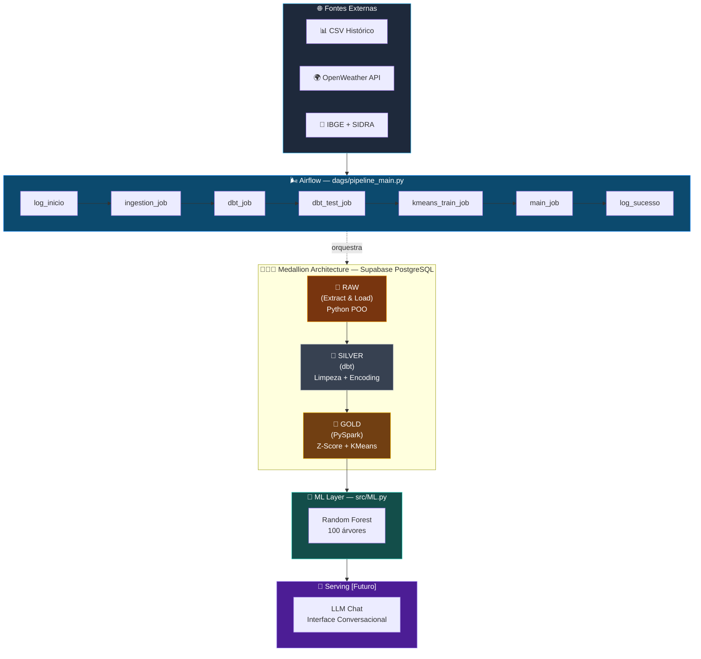
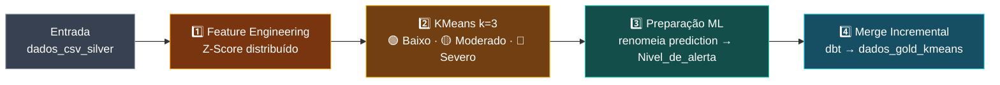
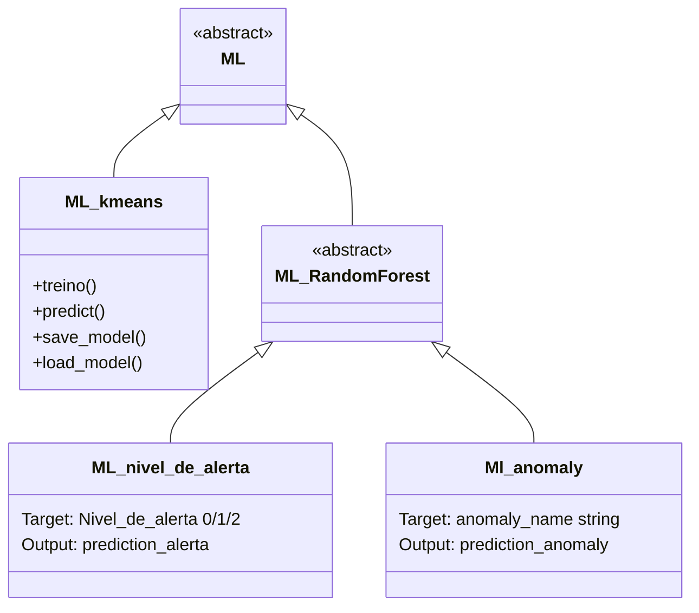
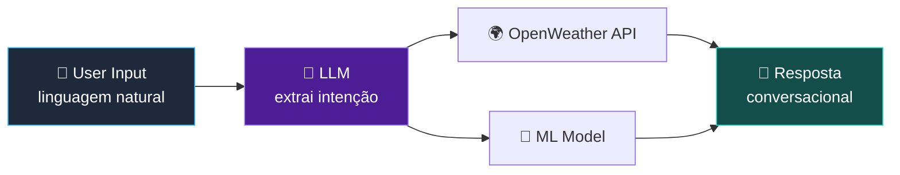
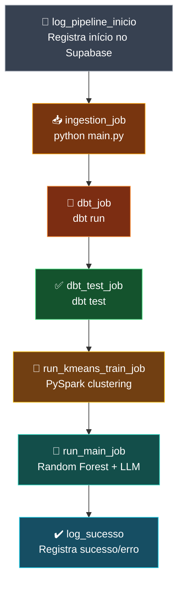
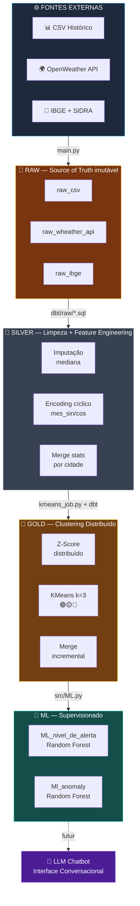
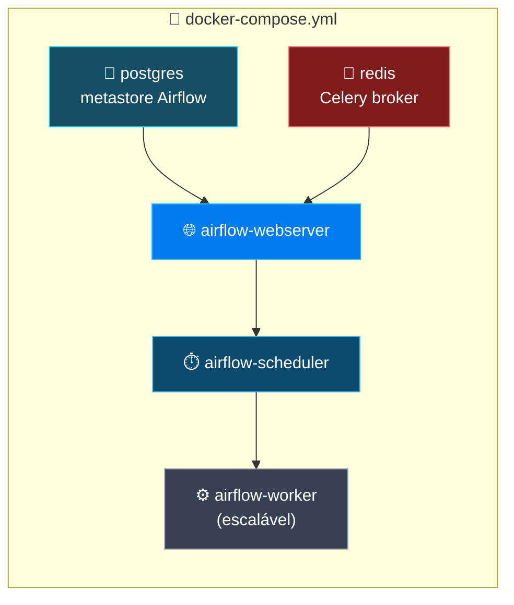

# 🌩️ Climate Anomaly Intelligence Platform

<div align="center">


**Plataforma end-to-end para detecção, classificação e previsão de anomalias climáticas.**
Integra múltiplas fontes de dados (APIs meteorológicas, IBGE, históricos) em uma pipeline de processamento distribuída, gerando predições de anomalias via Machine Learning supervisionado.

[](https://github.com/levi549/meteorologia)
[](https://github.com/levi549/meteorologia/issues)
[](#)

</div>

---

## 📑 Sumário

| | | | |
|---|---|---|---|
| [🏗️ Arquitetura](#️-arquitetura-de-alto-nível) | [🧩 Padrões](#-padrões-arquiteturais) | [🗂️ Camadas](#-detalhamento-por-camada) | [🌬️ Airflow](#-orquestração-apache-airflow) |
| [📁 Estrutura](#-estrutura-de-diretórios) | [🎯 Decisões Técnicas](#-padrões--decisões-técnicas) | [🔄 Fluxo de Dados](#-fluxo-completo-de-dados-fim-a-fim) | [▶️ Como Executar](#️-como-executar) |
| [🐳 Deploy](#-arquitetura-de-deployment--containerização) | [🧱 Stack](#-stack--dependências) | [🛠️ Troubleshooting](#️-troubleshooting) | [📬 Contato](#-contato--suporte) |

---

## 🛠️ Stack Tecnológica

<div align="center">

<table>
<tr>
<td align="center" width="120">
<a href="https://www.python.org/" target="_blank">
<br/>
<b>Python</b><br/>
<sub>3.12+</sub>
</a>
</td>
<td align="center" width="120">
<a href="https://airflow.apache.org/" target="_blank">
<br/>
<b>Airflow</b><br/>
<sub>3.2+</sub>
</a>
</td>
<td align="center" width="120">
<a href="https://spark.apache.org/docs/latest/api/python/" target="_blank">
<br/>
<b>PySpark</b><br/>
<sub>4.1+</sub>
</a>
</td>
<td align="center" width="120">
<a href="https://www.getdbt.com/" target="_blank">
<br/>
<b>dbt</b><br/>
<sub>1.10+</sub>
</a>
</td>
<td align="center" width="120">
<a href="https://supabase.com/" target="_blank">
<br/>
<b>Supabase</b><br/>
<sub>PostgreSQL 15+</sub>
</a>
</td>
<td align="center" width="120">
<a href="https://www.docker.com/" target="_blank">
<br/>
<b>Docker</b><br/>
<sub>Latest</sub>
</a>
</td>
</tr>
</table>

</div>

> 💡 Clique em qualquer ícone acima para acessar a documentação oficial da tecnologia.

---

## 🏗️ Arquitetura de Alto Nível

A plataforma segue uma **Medallion Architecture** (Raw → Silver → Gold), onde cada camada aumenta progressivamente a qualidade e o valor analítico dos dados, orquestrada de ponta a ponta pelo Apache Airflow.



---

## 🧩 Padrões Arquiteturais

Cada decisão de design abaixo documenta o **o quê**, **onde** e **por quê**.

<table>
<tr><th width="30%">Padrão</th><th width="35%">O quê / Onde</th><th width="35%">Por quê</th></tr>
<tr>
<td>🥇 <b>Medallion Architecture</b></td>
<td>Raw → Silver → Gold<br/><code>dbt/raw</code>, <code>dbt/silver_gold</code>, <code>pyspark_jobs</code></td>
<td>Separação de responsabilidades, qualidade progressiva</td>
</tr>
<tr>
<td>🧱 <b>Abstract Base Classes</b></td>
<td><code>Datasource(ABC)</code> com <code>Extract()</code>, <code>Load()</code><br/><code>src/class_file.py</code></td>
<td>Escalabilidade — adicionar fonte = 1 classe, sem quebrar código existente</td>
</tr>
<tr>
<td>♻️ <b>Incremental Processing</b></td>
<td><code>unique_key</code> + <code>incremental_strategy='merge'</code><br/>dbt models + <code>log_job</code></td>
<td>Eficiência — reprocessar apenas dados novos desde a última execução</td>
</tr>
<tr>
<td>📐 <b>Feature Engineering Distribuído</b></td>
<td>Z-Score por variável no cluster Spark<br/><code>pyspark_jobs/jobs/kmeans_job.py</code></td>
<td>Escalabilidade para datasets grandes</td>
</tr>
<tr>
<td>🔄 <b>Encoding Cíclico Temporal</b></td>
<td><code>mes_sin = SIN(2π·mês/12)</code>, <code>mes_cos = COS(2π·mês/12)</code><br/><code>dbt/raw/dados_csv_silver.sql</code></td>
<td>Dezembro e janeiro são adjacentes climaticamente — ML aprende melhor</td>
</tr>
<tr>
<td>🧵 <b>Context Manager de Logging</b></td>
<td><code>with log_job(nome, id) as logger: ...</code><br/><code>src/logs.py</code></td>
<td>Garante que o log sempre seja finalizado (sucesso ou erro)</td>
</tr>
</table>

---

## 🗂️ Detalhamento por Camada

### 🥉 4.1 Camada Raw (Bronze)

**Responsabilidade**: armazenar dados exatamente como vêm da fonte — source of truth imutável.

**Localização**: Supabase PostgreSQL (3 tabelas)

| Tabela | Fonte | Descrição |
|--------|-------|-----------|
| `raw_csv` | CSV histórico | Dados climáticos históricos por cidade |
| `raw_wheather_api` | OpenWeather API | Respostas JSON brutas de tempo real |
| `raw_ibge` | IBGE + SIDRA API | Dados populacionais por município |

> Sem transformação — pode conter NULLs, duplicatas e estruturas heterogêneas.

**Exemplo de código** (`src/class_file.py`):

```python
class CSV(Datasource):
    def Extract(self):
        # Lê CSV histórico de data/dados_Historic.csv
        with open(self.path, 'r', encoding='utf-8') as file:
            self.csv_file = list(csv.DictReader(file))

    def Load(self):
        # Carrega no Supabase com upsert (evita duplicatas)
        self.BD_conection.table("raw_csv").upsert(
            self.csv_file, on_conflict="city_id,dt"
        ).execute()
```

---

### 🥈 4.2 Camada Silver (Transformation & Cleaning)

**Responsabilidade**: limpeza, validação e encoding de features temporais.
**Localização**: `dbt/raw/` → tabelas Silver no Supabase

#### `dados_csv_silver.sql`

**Passo 1 — Imputação de Nulos (Mediana)**
Robusta a outliers climáticos (extremos de temperatura), diferente da média (viesada) ou forward-fill (inaplicável aqui).

```sql
SELECT
    COALESCE(temp, PERCENTILE_CONT(0.5) WITHIN GROUP (ORDER BY temp)) AS temp
FROM raw_csv
LEFT JOIN medianas_cidade ON raw_csv.city_id = medianas_cidade.city_id
```

**Passo 2 — Encoding Cíclico de Datas**

> **Problema**: mês 12 (dez) e mês 1 (jan) são adjacentes climaticamente, mas `|12 − 1| = 11` numericamente.
> **Solução**: projetar o mês em componentes seno/cosseno, aproximando dezembro e janeiro no espaço vetorial.

```sql
SELECT
    SIN(EXTRACT(MONTH FROM dt) * 2 * PI() / 12) AS mes_sin,
    COS(EXTRACT(MONTH FROM dt) * 2 * PI() / 12) AS mes_cos
FROM raw_csv
```

**Output**: tabela `dados_csv_silver`

```
id · city_name · city_id · dt · temp · humidity · pressure ·
mes_sin · mes_cos · weather_main · anomaly_name · ingested_at
```

Incremental (`unique_key='id'`, `on_schema_change='fail'`) — reprocessa apenas registros com `ingested_at` mais recente.

#### `dados_ibge_silver.sql`

Parse de JSON complexo do IBGE via `jsonb_path_query` + `jsonb_each`:

```sql
SELECT
    (retorno->'localidade'->>'nome') AS nome,
    trim(both '"' from ano.value::text)::int AS populacao,
    CURRENT_TIMESTAMP AS ingested_at
FROM dados_filtrados
CROSS JOIN LATERAL jsonb_each(retorno->'serie') AS ano
```

---

### 🥇 4.3 Camada Gold (Clustering & Preparation for ML)

**Responsabilidade**: feature engineering distribuído, clustering e preparação para treino supervisionado.
**Localização**: `pyspark_jobs/jobs/kmeans_job.py` + `dbt/silver_gold/gold_dados_kmeans.sql`



**Código PySpark** (`pyspark_jobs/jobs/kmeans_job.py`):

```python
# 1. Ler dados Silver com limites incrementais
limites = spark.read.jdbc(...).first()
v_min, v_max = limites["min_dt"], limites["max_dt"]

df = spark.read.jdbc(
    url=URL_SUPABASE,
    table=f"... WHERE ingested_at >= '{v_min}' AND ingested_at <= '{v_max}'",
    numPartitions=10
)

# 2. Feature Engineering (Z-Score)
for col in ['temp', 'humidity', 'pressure']:
    mean_val = df.select(mean(col)).first()[0]
    std_val = df.select(stddev(col)).first()[0]
    df = df.withColumn(f"{col}_zscore", (col(col) - mean_val) / std_val)

# 3. VectorAssembler
assembler = VectorAssembler(
    inputCols=['mes_sin', 'mes_cos', 'temp_zscore', ...],
    outputCol="features"
)
df_features = assembler.transform(df)

# 4. KMeans
kmeans = ML_kmeans()
kmeans.load_model(caminho_modelo)
df_labeled = kmeans.predict(df_features)

# 5. Limpeza e renomeação
df_final = df_labeled.drop("features").withColumnRenamed(
    "prediction", "Nivel_de_alerta"
)

# 6. Escrever no Supabase
df_final.write.jdbc(url=URL_SUPABASE, table="public.kmeans_resultado", mode="append")
```

**Modelo dbt Gold** (`dbt/silver_gold/gold_dados_kmeans.sql`):

```sql
WITH estatisticas_cidade AS (
    SELECT city_name,
           avg(temp) AS temp_media,
           stddev(temp) AS temp_desvio_padrao
    FROM dados_csv_silver
    GROUP BY city_name
),
dados_padronizados AS (
    SELECT d.id, d.dt, d.mes_sin, d.mes_cos,
           (d.temp - e.temp_media) / e.temp_desvio_padrao AS temp_padronizado
    FROM dados_csv_silver d
    LEFT JOIN estatisticas_cidade e USING (city_name)
)
SELECT *, CURRENT_TIMESTAMP AS ingested_at
FROM dados_padronizados
```

**Output**: tabela `dados_gold_kmeans`

```
id · dt · mes_sin · mes_cos ·
temp_padronizado · humidity_padronizado · pressure_padronizada ·
anomaly_name · ingested_at
```

---

### 🧠 4.4 Camada ML (Machine Learning Supervisionado)

**Responsabilidade**: treinar e prever com Random Forest em dados rotulados.
**Localização**: `src/ML.py`



**Modelo 1: `ML_nivel_de_alerta`**

```python
class ML_nivel_de_alerta(ML_RandomForest):
    def __init__(self):
        super().__init__(
            predictionCol="prediction_alerta",
            labelCol="Nivel_de_alerta"
        )
        self.Modelo = RandomForestClassifier(numTrees=100, maxDepth=5, maxBins=10, seed=0)

    def treino(self, data):
        self.Modelo_treinado = self.Modelo.fit(data)
```

| | |
|---|---|
| **Entrada** | `dados_gold_kmeans` rotulados pelo KMeans |
| **Saída** | 🟢 0 (Baixo) · 🟡 1 (Moderado) · 🔴 2 (Severo) |

---

### 💬 4.5 Camada de Interface (LLM Chatbot)

> 🚧 **Status**: não implementada ainda (planejada)



---

## 🌬️ Orquestração (Apache Airflow)

**Arquivo**: `dags/pipeline_main.py` · **DAG**: `pipeline_meteorologia_main`

| Parâmetro | Valor |
|---|---|
| `schedule_interval` | `@once` (executável manualmente) |
| `start_date` | `2026-07-01` |
| `catchup` | `False` |
| `tags` | `meteorologia`, `pyspark`, `dbt`, `ml` |



**Retry Policy**: 2 tentativas · delay de 10 minutos · callbacks `log_erro` (on_failure) e `log_sucesso` (on_success)

**Logging Integrado** (`src/logs.py`): cada job registra `data_inicio`, `data_fim`, `status` (RUNNING/SUCCESS/FAILED), `error` via context manager try/yield/finally.

```bash
# Manual (Airflow Web UI ou CLI)
airflow dags trigger pipeline_meteorologia_main
```

---

## 📁 Estrutura de Diretórios

```
meteorologia/
├── 📂 src/                          # Código-fonte principal
│   ├── class_file.py                # POO: Datasource (ABC) + 3 implementações
│   ├── ML.py                        # Hierarquia ML: 5 classes
│   └── logs.py                      # Context manager logging
│
├── 📂 dbt/                          # Projeto dbt (transformações)
│   ├── raw/                         # Modelos da camada SILVER
│   │   ├── dados_csv_silver.sql
│   │   └── dados_ibge_silver.sql
│   ├── silver_gold/                 # Modelos da camada GOLD
│   │   └── gold_dados_kmeans.sql
│   └── dbt_project.yml
│
├── 📂 pyspark_jobs/jobs/            # Jobs PySpark distribuídos
│   ├── kmeans_job.py                # Feature engineering + KMeans + prep ML
│   ├── kmeans_train_job.py          # [Inferência]
│   └── main_job.py                  # [Futuro] Orquestração ML + LLM
│
├── 📂 dags/
│   └── pipeline_main.py             # DAG principal com 7 tasks
│
├── 📂 data/
│   └── data_Historic.csv            # Histórico climático (ingestão)
│
├── 📂 logs/                         # Logs de execução
│
├── .env                             # Variáveis de ambiente (não-versionado)
├── dbt_project.yml
├── main.py                          # Entry point
├── pyproject.toml                   # Dependências (uv/pip)
└── README.md
```

---

## 🎯 Padrões & Decisões Técnicas

<details open>
<summary><b>7.1 · Por quê Supabase ao invés de outro Data Warehouse?</b></summary>
<br/>

| ✅ Supabase | ❌ Alternativas |
|---|---|
| PostgreSQL real, não proprietário | BigQuery — caro, vendor lock-in |
| dbt nativo (`dbt-postgres`) | Snowflake — caro, não open-source |
| APIs simples (`supabase-py`) | Data Lake (S3) — precisa de DMS extra |
| Real-time subscriptions | |
| Sem setup de infra (managed) | |

</details>

<details>
<summary><b>7.2 · Por quê dbt para Silver se Python também pode fazer?</b></summary>
<br/>

| ✅ dbt | ❌ Python |
|---|---|
| SQL declarativo (menos código) | Código procedural (mais verboso) |
| Versionamento (git) + CI/CD | Sem versionamento de transformações |
| Tests nativos (`dbt test`) | Testes adicionais necessários |
| Lineage automático | |
| Reutilização de macros (DRY) | |

</details>

<details>
<summary><b>7.3 · Por quê encoding cíclico de datas?</b></summary>
<br/>

Mês é cíclico (12 → 1 → 2 → ... → 12). Numericamente `|12−1| = 11` (distância alta), mas climaticamente janeiro segue dezembro.

A projeção seno/cosseno transforma esse ciclo 1D em espaço 2D contínuo — dezembro e janeiro ficam próximos, e o ML aprende a sazonalidade corretamente.

❌ Alternativa rejeitada: one-hot encoding (12 colunas binárias, peso desnecessário).

</details>

<details>
<summary><b>7.4 · Por quê KMeans com k=3 especificamente?</b></summary>
<br/>

Necessidade de negócio: 3 níveis de alerta (🟢 Baixo · 🟡 Moderado · 🔴 Severo).

| ✅ KMeans k=3 | ❌ Alternativas |
|---|---|
| Não-supervisionado | k=5 — muito granular |
| Escalável (PySpark distribuído) | DBSCAN — sensível a hiperparâmetros |
| Rápido, convergência para k pequeno | Supervisionado desde início — precisa labeled data upfront |
| Rotulação automática | |

</details>

<details>
<summary><b>7.5 · Por quê Random Forest para classificação supervisionada?</b></summary>
<br/>

| ✅ Random Forest | ❌ Alternativas |
|---|---|
| Robusto a outliers climáticos | Logistic Regression — assume linearidade |
| Captura interações entre features | SVM — caro computacionalmente |
| Importância de features automática | Neural Networks — overkill sem mais dados rotulados |
| PySpark MLlib nativo | |
| 100 árvores = balance accuracy/overfitting | |

</details>

<details>
<summary><b>7.6 · Por quê Abstract Base Classes (ABC) para ingestão?</b></summary>
<br/>

Extensibilidade: adicionar nova fonte = 1 classe nova, herdando `Extract()` e `Load()` — Strategy Pattern sem quebrar código existente.

```python
class Datasource(ABC):
    @abstractmethod
    def Extract(self): pass
    @abstractmethod
    def Load(self): pass

class API_custom(Datasource):
    def Extract(self): ...
    def Load(self): ...
```

</details>

---

## 🔄 Fluxo Completo de Dados (Fim-a-Fim)



---

## ▶️ Como Executar

### 9.1 Pré-requisitos

```bash
# Sistema
- Python 3.12+
- Java 11+ (requerido por PySpark)
- Git

# Contas & Credenciais
- Conta Supabase (https://supabase.com) configurada
- API Key da OpenWeather (https://openweathermap.org/api)
- Acesso às APIs IBGE e SIDRA (públicas, sem autenticação)
```

### 9.2 Instalação

```bash
# 1. Clonar repositório
git clone https://github.com/levi549/meteorologia.git
cd meteorologia

# 2. Criar ambiente virtual
python3.12 -m venv venv
source venv/bin/activate  # Linux/Mac
.\venv\Scripts\activate   # Windows

# 3. Instalar dependências com uv
pip install uv
uv sync

# 4. Configurar variáveis de ambiente
cp .env.example .env
# Editar .env com suas credenciais
```

### 9.3 Configuração dbt

```bash
cd dbt
dbt deps
dbt debug   # deve retornar "All checks passed!"
cd ..
```

### 9.4 Execução Manual (Por Etapa)

```bash
# Etapa 1: Ingestão
python main.py

# Etapa 2: Transformação Silver
cd dbt && dbt run --select raw

# Etapa 3: Teste de qualidade
dbt test

# Etapa 4: Clustering PySpark
spark-submit pyspark_jobs/jobs/kmeans_job.py

# Etapa 5: Finalização Gold
dbt run --select silver_gold

# Etapa 6: Treino do Modelo ML
python -c "from src.ML import ML_nivel_de_alerta; m = ML_nivel_de_alerta(); ..."
```

### 9.5 Execução via Apache Airflow (Recomendado para Produção)

```bash
airflow db init

airflow users create \
    --username admin --password admin \
    --firstname Admin --lastname Admin \
    --role Admin --email admin@airflow.com

airflow webserver --port 8080   # http://localhost:8080
airflow scheduler                # em outro terminal

airflow dags trigger pipeline_meteorologia_main
```

---

## 🐳 Arquitetura de Deployment & Containerização

> 🚧 **Status**: não implementada ainda (recomendação)

Estratégia: containerizar cada serviço (Airflow, PySpark, dbt, PostgreSQL) usando Docker e Docker Compose, isolando dependências e garantindo reprodutibilidade entre ambientes.



**Componentes previstos**:
- **Dockerfile**: baseado na imagem oficial do Airflow, com Java 11 (requisito PySpark) e dependências do projeto embutidas.
- **docker-compose.yml**: orquestra `postgres`, `redis`, `airflow-webserver`, `airflow-scheduler` e `airflow-worker` (escalável via réplicas), compartilhando as variáveis do Supabase e das APIs externas via `.env`.

### Como Usar

```bash
cp .env.example .env
docker-compose build
docker-compose up -d
docker-compose ps          # verificar saúde
# Web UI: http://localhost:8080 (admin:admin)
docker-compose down
```

---

## 🧱 Extensibilidade & Manutenção

<details>
<summary><b>➕ Como Adicionar Nova Fonte de Dados?</b></summary>

```python
class NovaFonte(Datasource):
    def __init__(self):
        super().__init__()
        self.dados = []

    def Extract(self):
        self.dados = requests.get("https://api.nova-fonte.com/data").json()

    def Load(self):
        self.BD_conection.table("raw_nova_fonte").insert(self.dados).execute()
```

1. Criar a classe em `src/class_file.py`
2. Usar em `main.py`
3. Criar modelo dbt em `dbt/raw/nova_fonte_silver.sql`
4. Trigger manual ou via Airflow DAG

</details>

<details>
<summary><b>➕ Como Adicionar Novo Modelo ML?</b></summary>

```python
class Ml_nova_tarefa(ML_RandomForest):
    def __init__(self):
        super().__init__(predictionCol="prediction_nova", labelCol="target_nova")

    def treino(self, data):
        self.Modelo_treinado = self.Modelo.fit(data)

    def predict(self, data):
        return self.Modelo_treinado.transform(data)
```

Integrar em `dags/pipeline_main.py`, treinar e servir predições.

</details>

<details>
<summary><b>🔧 Como Modificar Pipeline dbt?</b></summary>

```bash
dbt run --select nome_modelo
dbt test --select nome_modelo
dbt docs generate && dbt docs serve
git add dbt/ && git commit -m "feat: update modelo XYZ"
```

</details>

<details>
<summary><b>📈 Como Escalar com Docker?</b></summary>

```bash
docker-compose up -d --scale airflow-worker=4
```

</details>

---

## 🧱 Stack & Dependências

| Componente | Tecnologia | Versão | Função Arquitetural | Alternativas |
|---|---|---|---|---|
| Linguagem | [Python](https://www.python.org/) | 3.12+ | Implementação de lógica de negócio | Go, Scala |
| Orquestração | [Apache Airflow](https://airflow.apache.org/) | 3.2+ | DAG-based orchestration, retry, logging | Kubernetes, Prefect |
| Spark Integration | [airflow-providers-spark](https://airflow.apache.org/docs/apache-airflow-providers-apache-spark/) | 6.0+ | Executar jobs PySpark via Airflow | Kubernetes Operator |
| Data Warehouse | [Supabase](https://supabase.com/) (PostgreSQL) | 15+ | Armazenamento centralizado (Raw/Silver/Gold) | BigQuery, Snowflake |
| Transformação | [dbt-postgres](https://www.getdbt.com/) | 1.10+ | SQL declarativo para ELT | Spark SQL, Flink |
| Proc. Distribuído | [PySpark](https://spark.apache.org/docs/latest/api/python/) | 4.1+ | Feature engineering + KMeans escalável | Polars |
| Clustering | PySpark MLlib | 4.1+ | KMeans distribuído k=3 | scikit-learn, H2O |
| Classificação | PySpark MLlib | 4.1+ | Random Forest supervisionado | XGBoost, LightGBM |
| HTTP Client | [requests](https://requests.readthedocs.io/) | 2.34+ | Chamadas a APIs externas | httpx, aiohttp |
| Config | [python-dotenv](https://pypi.org/project/python-dotenv/) | 1.2+ | Gestão de variáveis de ambiente | Pydantic, hydra |
| Database Client | [supabase-py](https://github.com/supabase/supabase-py) | 2.30+ | Conexão com Supabase | psycopg2 |
| Containerização | [Docker](https://www.docker.com/) | Latest | Isolamento + produção | Podman |

---

## 📌 Roadmap

- [ ] Interface LLM Chatbot (`src/interface_llm.py`)
- [ ] Cálculo de impacto populacional
- [ ] API REST para servir modelos (FastAPI)
- [ ] Dashboard Streamlit/Grafana
- [ ] Testes unitários + CI/CD (GitHub Actions)
- [ ] Documentação `dbt docs generate`
- [ ] Containerização com Docker/docker-compose
- [ ] Kubernetes manifests (Helm)

### Como Contribuir

```bash
git checkout -b feat/nova-feature
git commit -am 'Add nova feature'
git push origin feat/nova-feature
# Abra um Pull Request
```

---

## 🛠️ Troubleshooting

| Problema | Causa | Solução |
|---|---|---|
| `ModuleNotFoundError: pyspark` | PySpark não instalado | `pip install pyspark>=4.1.2` |
| `SUPABASE_URL not found` | `.env` não configurado | `cp .env.example .env` e edite |
| `dbt run` — Connection error | Credenciais Supabase incorretas | Verifique `SUPABASE_URL`/`SUPABASE_KEY` |
| `KMeans.fit()` lento | Dataset grande / k alto | Reduzir partições Spark ou usar sample |
| DAG não aparece no Airflow | DAG fora do `AIRFLOW_HOME` | Verifique `dags_folder` em `airflow.cfg` |

---

## 📬 Contato & Suporte

<div align="center">

[](https://github.com/levi549)
[](https://github.com/levi549/meteorologia)
[](https://github.com/levi549/meteorologia/issues)

</div>

---

<div align="center">
<sub>Construído com 🌩️ por <a href="https://github.com/levi549">@levi549</a></sub>
</div>